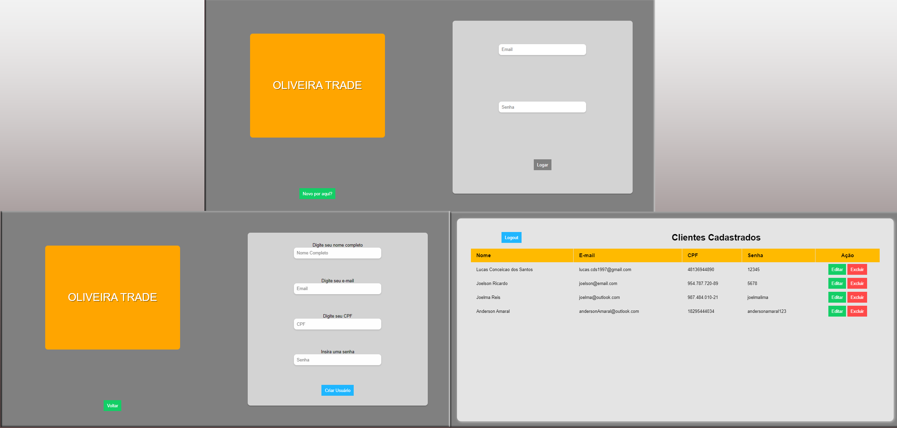
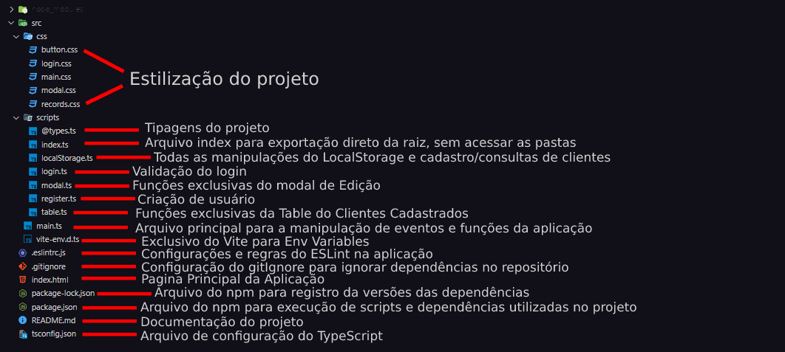
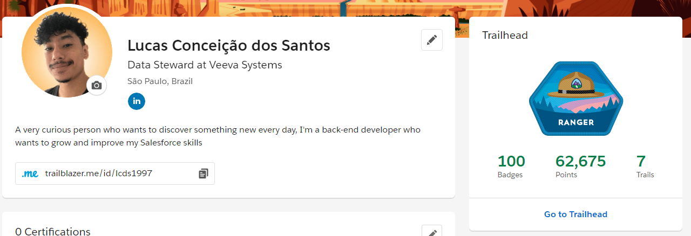

# Oliveira Trade Sign In/Sign Up Page

_Projeto desenvolvido para processo seletivo na [Everymind](https://www.everymind.com.br)_

## :bookmark_tabs: Sobre o Projeto
Nesse projeto foi desenvolvido uma página de SignIn/SignUp para a empresa fictícia **Oliveira Trade**, no qual eu tinha liberdade para usar as ferramentas e linguagens onde tenho mais familiriadade, no projeto foi utilizado:

:computer: **Linguagens:**
- HTML
- CSS
- Typescript
> Porque Typescript? A utilização do TypeScript proporciona a tipagem estática ao Javascript
>> Isso proporciona melhor leitura de código e evita bugs mostrando erros enquanto o código é digitado pelo usuário

:hammer: **Ferramentas:**
- EsLint
- Vite
>EsLint: é uma ferramenta de análise de código aonde juntamente com sua extensão permite identificar erros quanto ao padrão de escrita que definimos, proporcionando organização e padronização ao código
>> Build Tool Vite: É um bundler e um dev-server que consegue usar compiladores e frameworks direto, sem configuração, combinam os diferentes módulos da sua aplicação em um arquivo que você consiga usar em ambiente de produção.

:warning: **Informações**

- LocalStorage
> O projeto consiste em armazenar os dados dos clientes cadastrados no LocalStorage
>> As consultas em relação ao login e cadastro são feitas através da conversão de string para um array para manipulação no projeto e conversão de um array para string para armazenamento no LocalStorage 

### Layout do Projeto

:globe_with_meridians: [Deploy](https://project-oliveira-trade.vercel.app)

## 📜 Regras de Negócio

- ☑️ Criação de usuário no sistema
- ☑️ Campos mínimos de cadastro normal para Pessoa Física *(Nome,E-mail,CPF,Senha)*
- ☑️ Login de usuário
- ☑️ Validação de usuário no LocalStorage
- ☑️ Exibição de todos os usuários cadastrado no LocalStorage
- ☑️ Operações de edição e exclusão para cada cliente armazenado no LocalStorage

## :writing_hand: Informações

### :rocket: Execução

`npm install`
> Instalar as depedências do projeto para serem utilizadas as ferramentas disponiveis no mesmo

`npm run dev`
> Para rodar o projeto localmente, nele antes é inicilizado o server do bundle do Vite, e logo em seguida o servidor referente ao ambiente de desenvolvimento.

#### 📁 Estrutura e organização do código e dos arquivos

### Curiosidades

Estou desde setembro estudando a plataforma do Salesforce, caso queira da uma olhada no meu perfil do Trailhead 😉

